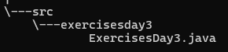
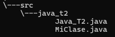
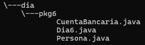
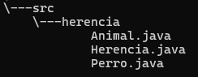
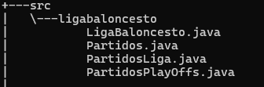

# **Java - Ejercicios y Actividades**

Este repositorio contiene ejercicios y explicaciones organizadas por días de trabajo, según lo planificado por el Trainer. Algunos días iniciales están ausentes debido a que estaban dedicados a refuerzo, y el **Día 9** no está presente porque se realizaron ejercicios en Hackerrank.

---

## **Tecnologías utilizadas**
- **Java**

---

## **Estructura del Proyecto**

Las actividades están organizadas en carpetas según el día de trabajo. A continuación, se describe brevemente cada día:

| **Día**   | **Descripción**                                             | **Imágenes**                            |
|-----------|-------------------------------------------------------------|-----------------------------------------|
| **Día 3** | Ejercicios sobre ciclos con menús de opciones.              |           |
| **Día 5** | Organización de clases y creación de un menú sencillo.      |            |
| **Día 6** | Manejo de encapsulamiento en tres ejercicios.               |            |
| **Día 7** | Uso de herencia y polimorfismo.                             |           |
| **Día 8** | Uso de arreglos y listas con un menú para conocer su funcionamiento. |          |

---

## **Características por Día**

### Día 3
- **Descripción**: Ejercicios relacionados con ciclos y menús de opciones.
- **Objetivo**: Practicar estructuras de control repetitivas mediante menús interactivos.

### Día 5
- **Descripción**: Organización de clases y creación de un menú funcional.
- **Objetivo**: Familiarizarse con la estructura de clases y cómo interactúan mediante menús.

### Día 6
- **Descripción**: Encapsulamiento en Java.
- **Objetivo**: Implementar el concepto de encapsulación en ejercicios prácticos.

### Día 7
- **Descripción**: Uso de herencia y polimorfismo en ejercicios de Java.
- **Objetivo**: Reforzar los conceptos de herencia y polimorfismo en un entorno práctico.

### Día 8
- **Descripción**: Manipulación de arreglos y listas mediante menús interactivos.
- **Objetivo**: Mejorar el manejo de colecciones en Java.

---

## **Instrucciones de Uso**

1. **Clonar el repositorio**:
   ```bash
   git clone <URL_DEL_REPOSITORIO>


## Desarrollado por

Los trabajos fueron realizados por Freiler Ortega Estupiñan CC.1010075774, estudiante de CampusLands para el módulo de Java.